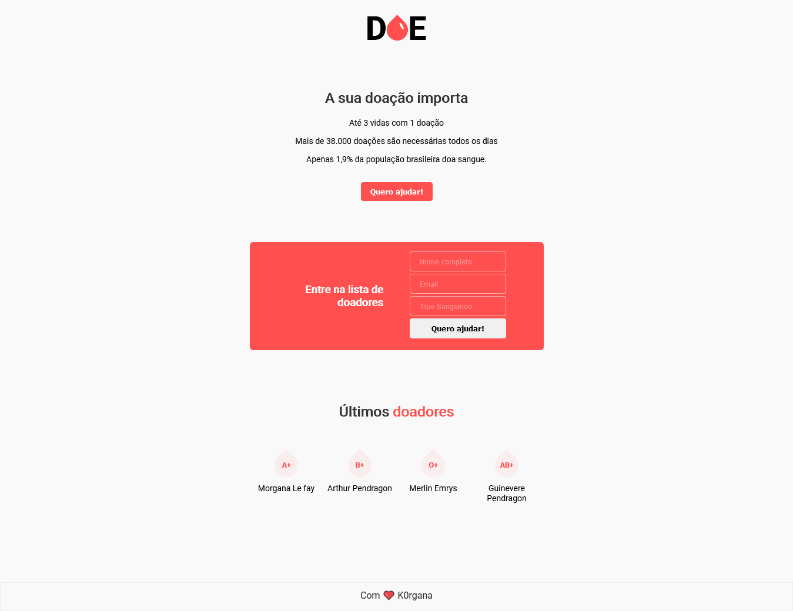

# Doe 

<p align="center">
  
</p>

Aplicação desenvolvida durante a MaratonaDev 3.0 da Rocketseat e a proposta é ser um banco de dados para doadores de sangue.

##  Tecnologias

- [NodeJs](https://nodejs.org/en)
- [Nunjucks](https://github.com/mozilla/nunjucks)
- [Nodemon](https://github.com/remy/nodemon)


##  Como rodar o projeto?

Após baixar o projeto, acesse ele via seu terminal rode os comandos:

```sh
npm install
npm start
```
Esses comandos irão baixar as dependências necessárias e rodar o projeto em modo de desenvolvimento.
Em seguida ira abrir para visualização em seu navegador pelo link http://localhost:3000

## Resultado

<p align="center">
  
  
</p>
